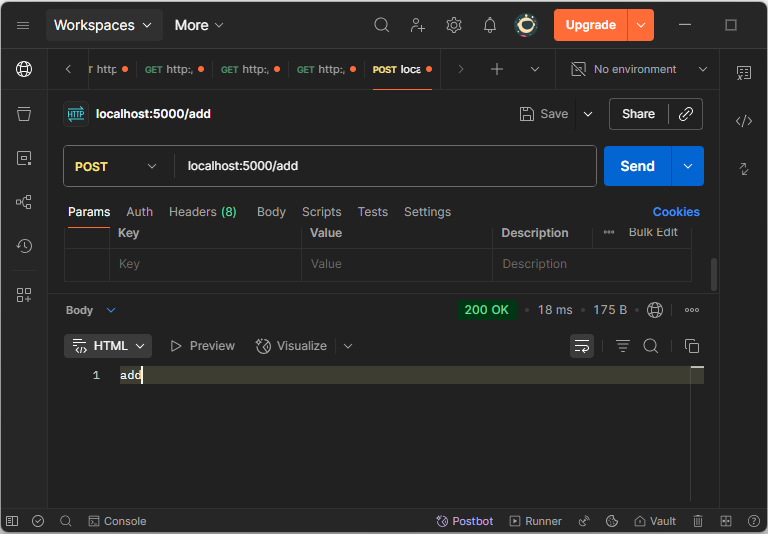
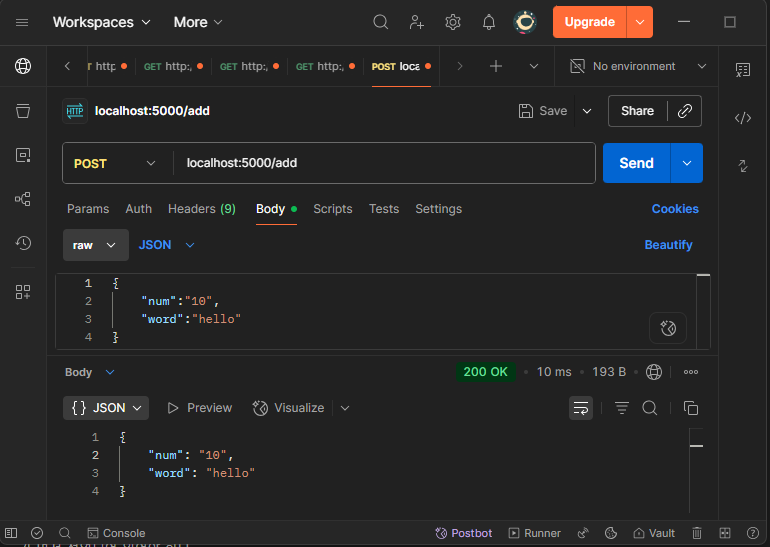

## Flask 설치
```bash
pip install flask
```

## 기본 메인 스레드 코드
- Get 방식 루트 요청
  ```py
  from flask import Flask # 웹 애플리케이션 클래스
  app = Flask(__name__) # 웹 애플리케이션 객체 생성 (실행되는 모듈 파일 정보 전달)
  
  @app.route('/') # route: url 경로와 함수를 연결하는 기능 (핸들러 매핑과 유사)
  def gello_world():
      return 'Hello World!'
  
  if __name__ == '__main__':
      app.run() # 웹서버 기동
  ```

## 기동
### 실행
- Pycharm
  ```bash
  Ctrl + Shift + F10
  ```
- VSC
  ```bash
  Ctrl + F5
  ```
### 디버그  
- Pycharm
  ```bash
  Ctrl + Shift + F19
  ```
- VSC
  ```bash
  F5
  ``
  
## 웹 서버 객체 생성과 모듈정보 전달
웹 서버 객체를 생성할 때 전달되는 __name__ 현재 생성되는 Flask 웹 서버 객체가 해당 모듈의 파일 위치를 기준으로  
애플리케이션의 루트 경로를 계산하고, template 및 static 같은 리소스 디렉토리를 찾기 위해 사용된다.  

그렇다면 Flask 객체가 실행되는 모듈이 "__main__"인 메인 모듈일 경우엔 모듈파일을 어떻게 찾아갈까?  
기본적으로 파이썬에서 최초 실행되는 파일은 인터프리터에 의해 내부적으로 실행된 파일의 모듈 객체를 만들고, 그 모듈 이름을 __main__로 지정한다.
### main 모듈 정보 출력 예제
```py
import sys
main_module = sys.modules["__main__"]
print(main_module) # <module '__main__' from '.../test.py'>
print(main_module.__file__) # "/project/app.py"
```

## Get방식 요청 파라미터 전달

### URL Variable (Variable Rule)
웹 서버 객체인 app의 route 데코레이터에 url을 지정할 때 중괄호 사이에 `<파라미터명>` 형태로 지정한다.  
기본적으로 문자열 타입이므로 정수 타입으로 받기 위해서는 파라미터명 앞에 `<int: 파라미터명>` `:` 구분자 기준으로 타입인 int를 지정한다
- string
  ```py
  from flask import Flask
  app = Flask(__name__)
  
  @app.route('/user/<username>')
  def show_user_profile(username):
      return 'User %s' % username
  
  if __name__ == '__main__':
      app.run()
  ```
- int  
  ```py
  from flask import Flask
  app = Flask(__name__)
  
  @app.route('/post/<int:post_id>')
  def show_post(post_id):
      return 'Post %d' % post_id
  
  if __name__ == '__main__':
      app.run()
  ```
  
### QueryString과 request 객체
질의문자열이라 부르며 웹사이트의 주소에 물음표 기호와 함께 부가 정보를 조회할때 사용하는 문자열이다.  
word라는 이름의 파라미터에 문자열 값 'hello'와 num이라는 이름의 파라미터에 문자열 값 '10'을 넘기는 URL은 다음과 같다.  
```
https://localhost:port/search?word=hello&num=10
```
Flask에서는 request 객체의 하위 객체 args에서 to_dict() 메소드를 통해 dictionary 형태로 값을 조회할 수 있다.  
- 코드
  ```py
  from flask import Flask, reqeust # request import
  app = Flask(__name__)
  
  @app.route('/search')
  def show_search():
      args_dict = reqeust.args.to_dict()
      return args_dict
  
  if __name__ == '__main__':
      app.run()
  ```
- 응답 결과
  ```
  {
    "num":"10",
    "word":"hello"
  }
  ```

단일 파라미터의 경우 get 메소드에 key를 전달하여 조회하거나 대괄호(브라켓) 접근법으로 접근 가능하다.   
- 코드
  ```py
  from flask import Flask, reqeust # request import
  app = Flask(__name__)
  
  @app.route("/search")
  def show_search():
      args_dict = request.args.to_dict()
      print(request.args.get('word'))
      # print(request.args.word) # MultiDict 객체이므로 지원하지 않음
      print(request.args['num'])
      return args_dict
  
  if __name__ == '__main__':
      app.run()
  ```

  (args 객체는 클래스의 필드로 구성된 객체가 아닌 MultiDict로, 도트 연산  접근은 지원하지 않는다.)
  - request.py (157Line)
    ```py
    @cached_property
        def args(self) -> MultiDict[str, str]:
    ```
    
# Post방식과 파라미터 전달

## 기본 코드
route 데코레이터의 2번째 인자 설정인 methods에 `methods=['POST']` 를 지정해준다.  
해당 옵션 생략시 GET 방식으로 조회된다.  
(`methods=['GET']`와 같이 GET방식을 명시적으로 지정할 수도 있다.)
```py
from flask import Flask, reqeust # request import
app = Flask(__name__)

@app.route('/add', methods=['POST'])
def add():
    return 'add'

if __name__ == '__main__':
      app.run()
```

### POSTMAN 요청



## 파라미터 전달(json)
```py
from flask import Flask, reqeust # request import
app = Flask(__name__)

@app.route('/add2', methods=['POST'])
def add2():
    data = request.get_json()
    print(request.get_json().get('word'))
    # print(request.get_json().word) # Dict이지만, json은 key-value 구조 그 자체이므로 접근 불가
    print(request.get_json()['num'])
    return data

if __name__ == '__main__':
      app.run()
```
(get_json() 함수가 반환하는 객체는 일반 Dict. 즉, key-value json 그 자체이므로 접근 불가하다.)

### POSTMAN 요청 및 결과
body에 json 형태로 전달한다.  

